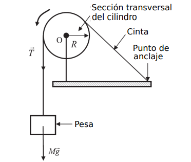

```{r setup, include=FALSE}
knitr::opts_chunk$set(echo = FALSE)
```

# Objetivos
Comprobación de la equivalencia entre trabajo y calor y medida de la relación entre caloría y Julio.

# Introducción
En esta práctica se dispone de una cinta enrollada en torno a un cilindro de aluminio de radio $R$, estando este montado sobre un eje rotatorio $O$, tal y como muestra la figura. La cinta queda sujeta a la mesa por un extremo y libre por el opuesto, donde cuelga una pesa de masa $M$. El soporte del cilindro cuenta con un termistor (resistencia eléctrica dependiente de la temperatura) conectado a un multímetro, así como con un contador que muestra el número de vueltas dadas por del cilindro.

{width="300"}

El trabajo $W$ realizado por la fuerza de rozamiento $F$ entre la cinta y el cilindro, para un desplazamiento $\Delta l$, viene dado por:

\begin{equation}
  W = F\Delta l
\end{equation}

El desplazamiento será $\Delta l = R\theta$, donde $\theta$ es el ángulo recorrido por el cilindro. Si consideramosel número de vueltas, se tendrá que $\theta = 2\pi N$. Así mismo la fuerza de rozamiento será la debida al peso de la pesa, es decir, $F = Mg$. Sustituyendo:

\begin{equation}
  W = 2\pi MgRN
\end{equation}

Tras rotar el cilindro por un determinado tiempo, el trabajo realizado generará una cantidad equivalente de calor:

\begin{equation}
  \frac{dQ}{dt} = \alpha \frac{dW}{dt}
\end{equation}

donde $\alpha = 1$ si tanto el calor como el trabajo se miden en Julios. Si el calor se mide en calorías y el trabajo en Julios, entonces $\alpha = \frac{1}{4.184}$ cal/J.

Nótese que hay que tener en cuenta también la potencia calorífica intercambiada con el laboratorio:

\begin{equation}
\frac{dQ}{dt} = \frac{dQ_{aparato}}{dt} + \frac{dQ_{laboratorio}}{dt}
\end{equation}

donde sólo el primer término será medible directamente. El calor recibido por el dispositivo se mide como:

\begin{equation}
  Q_{aparato} = C\Delta T
\end{equation}

donde $\Delta T = T - T_0$ es el aumento de temperatura con respecto a la temperatura inicial del cilindro $T_0$, y $C = mc + C_{termistor} + C_{cinta}$, siendo $m$ la masa del cilindro y $c$ el calor específico del aluminio. Para este experimento tenemos que $mc \gg C_{termistor} + C_{cinta}$, por lo que:

\begin{equation}
  Q_{aparato} \approx mc\Delta T
\end{equation}

Tras un tiempo $\Delta t$ se tiene:

\begin{equation}
  mc\Delta T + \left(\frac{dQ_{laboratorio}}{dt}\right)\Delta t = \alpha 2\pi MgRN
\end{equation}

# Dispositivo experimental y metodología

## Instrumentación
- Dispositivo específico para la medición del equivalente mecánico.
- Dispositivo medidor de temperatura específico para este montaje (multímetro).
- Una pesa cuya masa sea conocida.
- Un pie de rey.
- Una balanza.

\clearpage

## Montaje experimental

SO TO SPEAK

## Metodología

### Experiencia 1: Medida del cilindro en frío
1. El cilindro se encuentra en el congelador. Sácalo y deposítalo con cuidado en la mesa para atemperarlo ligeramente. Utiliza papel secante para limpiar el cilindro y quitarle los restos de humedad.
2. Medir $m$ con la balanza y el diámetro $D$ con el pie de rey. Medir $M$ con la báscula digital.
3. Coloca con delicadeza el cilindro en el eje de rotación, enroscando el tornillo negro para fijarlo.
4. Antes de enrollar la cinta, espolvorea una pequeña cantidad de grafito en polvo sobre el cilindro y, ayudándote de papel secante, rota el cilindro para esparcir el grafito por toda la superficie. Esto evitará un rozamiento excesivo entre la cinta y el cilindro.
5.  Enrolla con delicadeza la cinta alrededor del cilindro, dando unas 5 o 6 vueltas. Debes evitar en todo momento (incluyendo durante la rotación) que la cinta quede tensa en el punto de sujección a la mesa.
6. Mientras se sujeta firmamente la manivela de rotación, se cuelga con cuidado la pesa en la arandela del extremo libre de la cinta, a una distancia de unos pocos centímetros al suelo, soltándola de manera progresiva para evitar romper la cinta.
7. Ajustar el contador de vueltas a cero.
8. Enciende el multímetro para medir su resistencia. Comprueba su temperatura mediante la tabla de calibración del termisor. Comprueba la temperatura del laboratorio en el termómetro digital disponible.
9. Comienza el experimento: inicia el cronómetro y empieza a rotar el cilindro a ritmo constante, evitando que la pesa ascienda. Mide periodicamente el tiempo transcurrido, el número de vueltas y la resistencia del termisor.
10. Se debe rotar el cilindro a ritmo constante durante el tiempo suficiente como para que la temperatura final supere a la temperatura ambiente, en una magnitud igual a la diferencia entre la temperatura ambiente y la temperatura inicial del cilindro.


### Experiencia 2: Medida del cilindro a temperatura ambiente
1. Dejar que el cilindro alcance la temperatura ambiente.
2. Repetir la experiencia anterior desde el paso 6.
3. Al finalizar el proceso de calentamiento, inicia de nuevo el cronómetro y deja enfriar el cilindro, sin extrarlo del dispositivo, por un tiempo similar al tiempo de calentamiento. Anota periódicamente el tiempo de enfriamiento transcurrido y la resistencia del termistor.

\clearpage

# Medidas

SO TO SPEAK

```{r}
# Datos recogidos
X <- c(1,2,3,4,5,6,7)
Y <- c(1,2,3,4,5,6,7) 

# Tabla
data <- data.frame(X,Y)
colnames(data) <- c("Medida","m / g")
  
knitr::kable(
  data,
  caption="SO TO SPEAK",
  booktabs = TRUE,
  escape = FALSE,
  row.names = FALSE,
  align="c"
)
```

\clearpage

# Análisis de los Datos

## Experiencia 1
La representación del calor recibido por el cilindro $mc\Delta T$ frente al trabajo $2\pi MgRN$ realizado para el número de vueltas $M$ debe dar una recta cuya pendiente permite hallar $\alpha$. En este caso puede omitirse el intercambio de calor entre el cilindro y el laboratorio, ya que el calor absorbido por el cilindro cuando éste esté más frío que el ambiente será equivalente al desprendido cuando el cilindro esté más caliente que el ambiente.

```{r, echo=FALSE,  out.width= "90%", fig.align='center', fig.cap="Ajuste de Y sobre X"}
# Datos recogidos
X <- c(1,2,3,4,5,6,7)
Y <- c(1,2,3,4,5,6,7) 

# Ajuste lineal
modelo_lineal <- lm(Y ~ X)
resumen <- summary(modelo_lineal)
pendiente <- modelo_lineal$coefficients[[2]]
inc_pendiente <- resumen$coefficients[2,2]
ordenada <- modelo_lineal$coefficients[[1]]
inc_ordenada <- resumen$coefficients[1,2]

# Graficamos los datos y la línea de ajuste

titulo <- "Ajuste lineal de Y sobre X"
plot(X,Y, main = titulo, ylab =expression(Y ~ (cm^{-2})), xlab =expression(X ~ (s^{-1})))
abline(modelo_lineal, col = "coral")
```

\clearpage

## Experiencia 2
Para estimar el segundo término a la izquierda de la (7), ahora no despreciable, pondremos:

\begin{equation}
  \frac{dQ_{laboratorio}}{dt} \approx -mc \frac{dT_e}{dt}
\end{equation}

donde $T_e$ es la temperatura relativa al enfriamiento. Aunque $\frac{dT_e}{dt}$ no es constante, puede aproximarse como tal sustituyéndola con el valor de la pendiente de la regresión linear de la curva de enfriamento durante periodos de calentamiento no demasiado largos o, lo que es lo mismo, para diferencias de temperatura no demasiado altas. Corregir cada dato multiplicando la (8) por el relativo $\Delta t$ y volver a calcular $\alpha$.

```{r, echo=FALSE,  out.width= "90%", fig.align='center', fig.cap="Ajuste de Y sobre X"}
# Datos recogidos
X <- c(1,2,3,4,5,6,7)
Y <- c(1,2,3,4,5,6,7) 

# Ajuste lineal
modelo_lineal <- lm(Y ~ X)
resumen <- summary(modelo_lineal)
pendiente <- modelo_lineal$coefficients[[2]]
inc_pendiente <- resumen$coefficients[2,2]
ordenada <- modelo_lineal$coefficients[[1]]
inc_ordenada <- resumen$coefficients[1,2]

# Graficamos los datos y la línea de ajuste

titulo <- "Ajuste lineal de Y sobre X"
plot(X,Y, main = titulo, ylab =expression(Y ~ (cm^{-2})), xlab =expression(X ~ (s^{-1})))
abline(modelo_lineal, col = "coral")
```

\clearpage

# Resultados
SO TO SPEAK

# Discusión y conclusiones de los resultados
Obtener $\alpha$ por ambos métodos, incluyendo el análisis de incertidumbre y error con respecto al valor de referencia. Comparar la efectividad de cada procedimiento.

