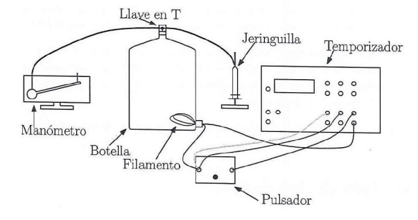

```{r setup, include=FALSE}
knitr::opts_chunk$set(echo = FALSE)
```

# Objetivos

- Determinación del calor específico del aire a presión constante y a volumen constante.
- Comprobación de la relación de Mayer y del valor del coeficiente de dilatación adiabática para un gas ideal.

# Marco teórico

La capacidad calorífica \( C \) de una sustancia viene expresada por:
\begin{equation} 
  C = \frac{dQ}{dT}
\end{equation}
Normalmente un proceso no viene definido completamente por la variación de temperatura, sino que se exige el conocimiento de otros parámetros macroscópicos. La capacidad calorífica tiene un valor definido sólo para un proceso definido. Los dos procesos principales son los de presión constante y volumen constante.

La capacidad calorífica a volumen constante se expresa del modo:
\begin{equation} 
  C_V = \left( \frac{dQ}{dT} \right)_V
\end{equation} 
Del mismo modo, la capacidad calorífica a presión constante es:
\begin{equation} 
  C_P = \left( \frac{dQ}{dT} \right)_P 
\end{equation} 
Si tomamos como unidad de cantidad de sustancia el mol, dividiendo por el número de moles \( n \) obtenemos los calores molares:
\begin{equation} 
  \overline{C} = \frac{1}{n} \frac{dQ}{dT}
\end{equation} 
Según la teoría, el calor molar a volumen constante de un gas ideal viene dado por:
\begin{equation} 
  \overline{C}_V = \frac{f}{2} R 
\end{equation} 
donde \( f \) es el número de grados de libertad del gas ideal estudiado. Para el gas ideal monoatómico \( f = 3 \) y para el diatómico \( f = 5 \).

De acuerdo con la Primera Ley de la Termodinámica y la ecuación de estado para gases ideales, la relación de Mayer establece que:
\begin{equation} 
  \overline{C}_{P} - \overline{C}_{V} = R
\end{equation} 
donde \( R \) es la constante universal de los gases ideales, \( R = 8,31 \, \text{J/(K mol)} \).

Por otro lado, el coeficiente de dilatación adiabática del gas ideal viene dado por:
\begin{equation} 
  \gamma = \frac{C_{P}}{C_{V}} = \frac{f + 2}{f}
\end{equation} 

## Calor específico molar a volumen constante

Para la medida de \( C_V \) se calienta el aire encerrado en una botella de volumen \( V \) mediante el calor producido por una corriente eléctrica \( I \) y un potencial constante \( V_e \) durante un tiempo \( t \). Por lo tanto el calor aplicado al aire será:
\begin{equation} 
  Q = V_e I t
\end{equation} 
Para una transformación isócola el aumento de temperatura \( \Delta T \) y el aumento de presión \( \Delta P \) están relacionados mediante:
\begin{equation} 
 \Delta T = \frac{V}{nR} \Delta P
\end{equation}  
Por tanto:
\begin{equation} 
  \overline{C}_{V} = \frac{1}{n} \left( \frac{Q}{\Delta T} \right)_V = \frac{V_e I R}{V \Delta P}
\end{equation} 
La medida de \( \Delta P \) frente al tiempo \( t \) que se aplica la corriente:
\begin{equation} 
  \Delta P = \frac{V_e I R}{V \overline{C}_{V}} t = a t
\end{equation} 
permite obtener \( C_V \) de la pendiente \( a = V_e I R / V \overline{C}_{V} \) obtenida por mínimos cuadrados.

## Calor específico molar a presión constante

Para la medida de \( C_P \) se calienta el aire, permitiendo el aumento de volumen del gas empujando el émbolo de la jeringuilla, de tal manera que se mantenga la presión igual a la atmosférica en todo momento, \( P = P_{\text{atm}} \). Para una transformación isobárica, el aumento de temperatura \( \Delta T \) y el aumento de volumen \( \Delta V \) vienen relacionados por:
\begin{equation} 
  \Delta T = \frac{P}{nR} \Delta V
\end{equation} 
Por tanto, el calor específico molar a presión constante quedará expresado como:
\begin{equation} 
  \overline{C}_{P} = \frac{1}{n} \left( \frac{Q}{\Delta T} \right)_P = \frac{V_e I R}{P \Delta V}
\end{equation} 
La medida de \( \Delta V \) frente al tiempo \( t \) que se aplica la corriente:
\begin{equation} 
  \Delta V = \frac{V_e I R}{P \overline{C}_{P}} t = a t
\end{equation} 
permite obtener \( C_P \) de la pendiente \( a = V_e I R / P \overline{C}_{P} \) obtenida por mínimos cuadrados.

\clearpage

# Dispositivo experimental y metodología

## Montaje experimental

Para ambos experimentos utilizaremos el mismo dispositivo. Tenemos una botella (con su volumen previamente medido, \( V = 5 \, \text{l} \)). En el tapón de la misma viene acoplada una llave de paso para poder mantener el sistema a volumen o presión constante. En la llave están conectadas dos gomas: una conectada a una jeringuilla (con la que mediremos la variación de volumen) y la otra goma conectada a un manómetro para medir la presión.

{width="250"}

La resistencia calefactora va conectada a un circuito de corriente alterna, con potencial e intensidad constante, conectada a su vez a un temporizador, por lo que podremos medir la cantidad de calor y un pulsador para controlar la cantidad de tiempo que aplicamos ese calor.

\begin{figure}[H]
  \begin{subfigure}{.31\textwidth}
    \centering
    \includegraphics[width=\linewidth]{figuras/manometro.jpg}
    \caption{Manómetro.}
  \end{subfigure}%
  \hfill 
  \begin{subfigure}{.31\textwidth}
    \centering
    \includegraphics[width=\linewidth]{figuras/botella.jpg}
    \caption{Botella aislada con corcho.}
  \end{subfigure}%
  \hfill 
  \begin{subfigure}{.31\textwidth}
    \centering
    \includegraphics[width=\linewidth]{figuras/temporizador.jpg}
    \caption{Temporizador.}
  \end{subfigure}%
  \caption{Dispositivos experimentales 1}
\end{figure}

\begin{figure}[H]
  \begin{subfigure}{.31\textwidth}
    \centering
    \includegraphics[width=\linewidth]{figuras/jeringuilla.jpg}
    \caption{Jeringuilla.}
  \end{subfigure}%
  \hfill 
  \begin{subfigure}{.31\textwidth}
    \centering
    \includegraphics[width=\linewidth]{figuras/multimetro.jpg}
    \caption{Multímetros.}
  \end{subfigure}%
  \hfill 
  \begin{subfigure}{.31\textwidth}
    \centering
    \includegraphics[width=\linewidth]{figuras/pulsador.jpg}
    \caption{Pulsador.}
  \end{subfigure}%
  \caption{Dispositivos experimentales 2}
\end{figure}

## Metodología

### Experiencia 1: Medida del calor específico molar a volumen constante

1. Durante esta experiencia no se variará el volumen de aire en la jeringuilla. Mantenla en todo momento a un volumen de 0 ml. Puede usarse la llave en forma de “T” para aislar la jeringuilla de la botella. Suelta la goma que va al manómetro y espera unos minutos hasta que la presión y temperatura del aire de la botella se equilibren con las atmosféricas. Mide y anota la presión inicial marcada por el manómetro.

2. Ajusta la goma a la salida del manómetro que está sobre el depósito de líquido. Si el aire de la botella está equilibrado, la lectura del manómetro no debería cambiar de forma apreciable.

3. Cerramos el circuito eléctrico con el pulsador, apretando durante un tiempo determinado. El tiempo que mantengamos el dedo pulsado quedará grabado en el temporizador. Observa cómo la barra de líquido rojo va ascendiendo por el manómetro mientras aplicamos calor. Anotamos la presión máxima medida para poder obtener la variación de presión.

4. Repetimos el proceso para tiempos mayores y obtener distintas medidas de \( \Delta P \) vs \( t \). Antes de cada nueva medida, conviene desconectar la goma del manómetro y permitir que el aire de la botella vuelva a las condiciones ambientales, durante aproximadamente un minuto.

### Experiencia 2: Medida del calor específico molar a presión constante

1. Durante esta experiencia sí se variará el volumen de aire en la jeringuilla. Usa la llave en forma de “T” para conectar de nuevo la jeringuilla de la botella. Suelta la goma que va al manómetro y espera unos minutos hasta que la presión y temperatura del aire de la botella se equilibren con las atmosféricas. Mide y anota la presión inicial marcada por el manómetro.

2. Ajusta la goma a la salida del manómetro que está sobre el depósito de líquido. Si el aire de la botella está equilibrado, la lectura del manómetro no debería cambiar de forma apreciable.

3. Al calentar el gas, la presión en la botella comenzará a aumentar. Al aumentar el volumen de la jeringuilla verás como la presión en el manómetro disminuye. La estrategia consistirá en aplicar corriente para calentar durante el tiempo suficiente como para que la presión máxima del manómetro vuelva al valor anotado en el punto 1, o muy próxima. Para cada volumen, realiza varias medidas de tiempo (al menos 3) que resulten en presiones máximas próximas a la inicial.

4. Podemos repetir el proceso para volúmenes mayores  y obtener distintas medidas de \( \Delta V \) vs \( t \). Antes de cada nueva medida, conviene desconectar la goma del manómetro, volver a poner el volumen de la jeringuilla a 0 ml y permitir que el aire de la botella vuelva a las condiciones ambientales, durante aproximadamente un minuto.

## Metodología para el análisis de los datos

### Experiencia 1: Medida del calor específico molar a volumen constante

1. Representa \( \Delta P \) frente a \( t \) y realiza un ajuste por mínimos cuadrados, obteniendo el valor e incertidumbre de la pendiente.

2. Halla el valor del calor específico molar a volumen constante y su incertidumbre a partir de la pendiente obtenida.

### Experiencia 2: Medida del calor específico molar a presión constante

1. Representa \( \Delta V \) frente a \( t \) y realiza un ajuste por mínimos cuadrados, obteniendo el valor e incertidumbre de la pendiente.

2. Halla el valor del calor específico molar a presión constante y su incertidumbre a partir de la pendiente obtenida.

\clearpage

# Medidas y análisis de los datos

## Experiencia 1:

Volumen constante 10 L

```{r}
volumen <- 10*1e-3 #m^3
voltaje <- 4.81 # Volttttios
intensidad <- 0.26 # Amperios
Tlab <- 18.9 + 273.15 # Kelvin
Plab <- 1012.6*1e2 # Pascales
R <- 8.314472 #Pa m^3/mol K
  
# Datos recogidos
t <- c(0.468, 0.863, 1.214, 1.617, 2.071, 2.639, 3.345, 4.069, 4.537, 5.253)
P <- c(0.1,0.2,0.3,0.4,0.5,0.6,0.7,0.8,0.9,1) 

# Tabla
data <- data.frame(t,P)
colnames(data) <- c("Tiempo / s","Presión / mbar")
  
knitr::kable(
  data,
  caption="Tiempo que se ha mantenido el circuito cerrado para realizar cada variación de presión",
  booktabs = TRUE,
  escape = FALSE,
  row.names = FALSE,
  align="c"
)
```

A partir de las medidas experimentales hacemos un ajuste de acuerdo a la ecuación (11), 

```{r, echo=FALSE,  out.width= "90%", fig.align='center', fig.cap="Ajuste por mínimos cuadrados"}

t <- t[1:5]
P <- P[1:5]

# Ajuste lineal
modelo_lineal <- lm(P ~ t)
resumen <- summary(modelo_lineal)
pendiente <- modelo_lineal$coefficients[[2]]
inc_pendiente <- resumen$coefficients[2,2]
ordenada <- modelo_lineal$coefficients[[1]]
inc_ordenada <- resumen$coefficients[1,2]

# Graficamos los datos y la línea de ajuste
titulo <- "Ajuste lineal de P sobre t"
plot(t,P, main = titulo, ylab =expression(P ~ (mbar)), xlab =expression(t ~ (s)))
abline(modelo_lineal, col = "coral")

# Cálculo de Cv
Cv <- voltaje*intensidad*R/(volumen*pendiente*100) # 1 mbar = 100 Pa
inc_Cv <- voltaje*intensidad*R/volumen * inc_pendiente/pendiente^2 * 1/100
```

obtiendo los siguientes resultados:

- Pendiente: $a = \frac{V_e I R}{ V \overline{C}_{V}} =`r pendiente` \ \frac{mbar}{s}$

- Incertidumbre pendiente: $\Delta a =`r inc_pendiente` \ \frac{mbar}{s}$

Expresandolo correctamente:
\[
a = `r round(pendiente,2)` \pm `r signif(inc_pendiente,2)` \ \frac{mbar}{s}
\]

Despejando de $\overline{C}_{V}$ a partir de la pendiente como $\overline{C}_{V} = \frac{V_e I R}{ V a}$, obtenemos un valor de $\overline{C}_{V} =`r Cv` \ \frac{J}{mol \ K}$. Si además usamos la fórmula de propagación de errores \(\sigma^2 = \sum_i (\partial f / \partial x_i)^2 \sigma_i^2\), la expresión que tenemos que usar para calcular el error es:

\begin{equation}
\Delta \overline{C}_{V} = \frac{V_e I R}{ V } \cdot \frac{\Delta a}{a^2}
\end{equation}

de donde obtenemos que $\Delta \overline{C}_{V} =`r inc_Cv` \ \frac{J}{mol \ K}$. Expresándolo correctamente:

\[
\overline{C}_{V} = `r round(Cv,2)` \pm `r signif(inc_Cv,2)` \ \frac{J}{mol \ K}
\]

\clearpage

## Experiencia 2:

Presión del laboratorio $P_{lab} = 1012.6$ HPa.

```{r}
# Datos recogidos
V2 <- 1:5 #mL
t2_1 <- c(0.411, 0.727, 1.081, 1.487, 1.874)
t2_2 <- c(0.417, 0.840, 1.047, 1.571, 2.040)
t2_3 <- c(0.446, 0.800, 1.052, 1.340, 1.905)
t2 <- (t2_1 + t2_2 + t2_3)/3

# Tabla
data <- data.frame(t2,V2)
colnames(data) <- c("Tiempo / s","Volumen / mL")
  
knitr::kable(
  data,
  caption="Tiempo que se ha mantenido el circuito cerrado para compensar cada variación de volumen",
  booktabs = TRUE,
  escape = FALSE,
  row.names = FALSE,
  align="c"
)
```

A partir de las medidas experimentales hacemos un ajuste de acuerdo a la ecuación (14), 

```{r, echo=FALSE,  out.width= "90%", fig.align='center', fig.cap="Ajuste por mínimos cuadrados"}
# Ajuste lineal
modelo_lineal2 <- lm(V2 ~ t2)
resumen2 <- summary(modelo_lineal2)
pendiente2 <- modelo_lineal2$coefficients[[2]]
inc_pendiente2 <- resumen2$coefficients[2,2]
ordenada2 <- modelo_lineal2$coefficients[[1]]
inc_ordenada2 <- resumen2$coefficients[1,2]

# Graficamos los datos y la línea de ajuste
titulo <- "Ajuste lineal de V sobre t"
plot(t2,V2, main = titulo, ylab =expression(V ~ (mL)), xlab =expression(t ~ (s)))
abline(modelo_lineal2, col = "coral")

# Cálculo de Cv
Cp <- voltaje*intensidad*R/(Plab*pendiente2*1e-6) # 1 mL = 1e-6 m^3
inc_Cp <- voltaje*intensidad*R/Plab * inc_pendiente2/pendiente2^2 * 1e6
```

obtiendo los siguientes resultados:

- Pendiente: $a = \frac{V_e I R}{ P \overline{C}_{P}} =`r pendiente2` \ \frac{mL}{s}$

- Incertidumbre pendiente: $\Delta a =`r inc_pendiente2` \ \frac{mL}{s}$

Expresandolo correctamente:
\[
a = `r round(pendiente2,2)` \pm `r signif(inc_pendiente2,2)` \ \frac{mL}{s}
\]

Despejando de $\overline{C}_{P}$ a partir de la pendiente como $\overline{C}_{P} = \frac{V_e I R}{ P a}$, obtenemos un valor de $\overline{C}_{P} =`r Cp` \ \frac{J}{mol \ K}$. Si además usamos la fórmula de propagación de errores \(\sigma^2 = \sum_i (\partial f / \partial x_i)^2 \sigma_i^2\), la expresión que tenemos que usar para calcular el error es:

\begin{equation}
\Delta \overline{C}_{P} = \frac{V_e I R}{ P } \cdot \frac{\Delta a}{a^2}
\end{equation}

de donde obtenemos que $\Delta \overline{C}_{P} =`r inc_Cp` \ \frac{J}{mol \ K}$. Expresándolo correctamente:

\[
\overline{C}_{P} = `r round(Cp,2)` \pm `r signif(inc_Cp,2)` \ \frac{J}{mol \ K}
\]

\clearpage

# Resultados
```{r}
# Cálculo de R
Rexp <- Cp - Cv
inc_Rexp <- sqrt(inc_Cp^2 + inc_Cv^2)
```

Como $R = \overline{C}_{P} - \overline{C}_{V}$, el error que estamos cometiendo es $\Delta R = \sqrt{\Delta \overline{C}_{P}^2 + \Delta \overline{C}_{V}^2}$. Haciendo los cálculos correspondientes y expresandolo correctamente el resultado llegamos a que:

\[
R = `r round(Rexp,2)` \pm `r signif(inc_Rexp,2)` \ \frac{J}{mol \ K}
\]

mientras que el valor real es, aproximadamente:
$$
R = 8.3145 \ \frac{J}{mol \cdot K}
$$
obteniendo así un error relativo de:
$$
\mathcal{E}_{R}(R) = \frac{|R^{teor}-R^{exp}|}{|R^{teor}|}\simeq 1.34
$$
además de que un signo negativo en la constante de los gases ideales no tiene coherencia física, pues $P,V,n,T \geq 0$ y, para estos gases, $PV=nRT$.

# Discusión y conclusiones de los resultados

Dados los resultados obtenidos y conociendo el valor real de la constante $R$, resulta obvio que deben existir fuentes de error más allá de las que manifiesta la incertidumbre en los resultados y que intervienen en los valores experimentales, reduciendo así su fiabilidad. Como no conocemos qué tipo de gas ideal es el que está contenido en nuestra botella, usamos el valor de $R$ en las comparativas en vez de los de los calores específicos a presión y volumen constante.

Mencionemos, primero, las posibles fuentes de error procedentes de nuestros instrumentos de medida. En el manómetro, además de entrañar cierta dificultad para determinar cuándo proporcionaba un valor nulo de la diferencia de presión, también pudimos observar que ofrecía distintos valores de diferencia de presión para experiencias prácticamente idénticas. Esto es, para valores similares de tiempo en la primera experiencia o volumen extraído en la segunda. Además, en esta segunda experiencia, debemos destacar que el instrumento utilizado (jeringuilla) disponía de una precisión del mismo orden que las magnitudes manejadas ($1mL$), induciendo así mayores errores relativos.

Aunque no se haya podido comprobar empíricamente, podríamos sospechar de la presencia de algún tipo de pérdidas del gas en la botella. De hecho, estas podrían ocasionarse en las reiteradas medidas en la segunda experiencia, pues en esta fuimos extrayendo una porción del volumen del gas con nuestra jeringuilla, y es posible que no regresara íntegramente a la botella, generando así pérdidas.

Aun siendo los valores de $I$ y $V_e$ constantes a lo largo de todo el experimento y a pesar de haber procedido meticulosamente, hemos obtenido unos valores de $\bar{C_P}$ y $\bar{C_V}$ dispares respecto a los reales:

COMENTAR QUÉ VALORES DE Cv Y CP PUEDEN SER (POR PROXIMIDAD, O SIMPLEMENTE ANALIZANDO LOS DOS CASOS) Y COMPARARLOS CON LOS OBTENIDOS.

CANCIÓN DEL DÍA: [https://www.youtube.com/watch?v=MFsoZ__2WzQ]