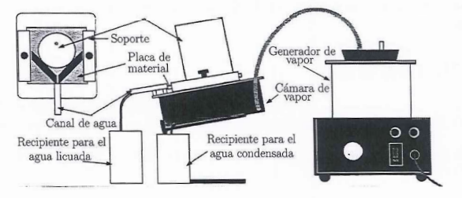

```{r setup, include=FALSE}
knitr::opts_chunk$set(echo = FALSE)
```

# Objetivos

- Determinación del coeficiente de conductividad térmica de algunos materiales.

# Introducción

La **corriente calorífica** \(J_{q}\) a través de una determinada sección recta, de abscisa \(x\), es directamente proporcional al área de dicha sección recta y al cambio de temperatura por unidad de longitud a lo largo de la barra o gradiente de temperatura; así, podemos escribir:

\begin{equation}
 J_{q} = -k S \frac{\delta \theta}{\delta x} \ \ [JS^{-1}]
\end{equation}

El signo negativo indica que la energía fluye en la dirección en que disminuye la temperatura. La constante de proporcionalidad \(k\) es un parámetro característico de cada material, denominado **coeficiente de conductividad térmica**, cuyo valor siempre es positivo. En particular, la corriente calorífica que fluye por un material de forma cilíndrica en función de las temperaturas de sus extremos:

\begin{equation}
  J_{q} = k S \frac{\theta_{1} - \theta_{2}}{L} \ \ [JS^{-1}]
\end{equation}

Sabiendo que \(\delta Q = J_{q} \cdot \delta t\) podemos decir que:

\begin{equation}
  \Delta Q = k S \frac{\Delta \theta}{h} \Delta t \ \ [J]
\end{equation}

Donde \(S\) es el área transversal a la dirección de flujo de calor; \(\Delta \theta\), es la diferencia de temperatura entre las caras del material; \(h\), es el espesor del material; y \(k\), es el coeficiente de conductividad térmica.

Para medir la conductividad térmica de un material, es necesario saber la cantidad de calor que fluye por él. Para ello, en el experimento, colocamos el material objeto de estudio entre una cámara de vapor de agua (\(\theta_{1} = 100^{o}C\)) y un bloque de hielo (\(\theta_{2} = 0^{o}C\)) y medimos la masa \(m\) de hielo derretido: por lo tanto, la cantidad de calor transmitido será \(\Delta Q = m L_{f}\). Sustituyendo se obtiene:

\begin{equation}
  k = \frac{m L_{f} h}{S \Delta \theta \Delta t} \ \ [JK^{-1}s^{-1}m^{-1}]
\end{equation}

siendo \(L_{f} = 80 \ \ cal \ g^{-1}\) el calor latente de fusión del agua y \(\Delta \theta = 100^{o}C\). Si llamamos \(R \equiv m / \Delta t\) la masa de hielo derretida por unidad de tiempo, se obtiene:

\begin{equation}
  k = \frac{R L_f h}{S \Delta \theta} \ \ [JK^{-1}s^{-1}m^{-1}]
\end{equation}

# Dispositivo experimental y metodología

## Instrumentación

- Moldes de hielo.
- Placas de distintos materiales: yeso, metacrilato, madera y aluminio.
- Generador de vapor.
- Balanza para pesar la masa de hielo derretido.
- Cámara de vapor con un soporte para la muestra.
- Recipientes para recoger el hielo fundido y el vapor condensado.
- Gomas para conectar el generador de vapor con la cámara.
- Un pie de rey para medir los diámetros de los cilindros de hielo.
- Una regla para medir la altura de los bloques de hielo.
- Un cronómetro, para contabilizar el tiempo transcurrido.

## Montaje experimental

Antes de empezar la práctica, es necesario tener preparados los moldes de hielo. Para poder sacar los bloques de hielo de sus moldes con facilidad, poner el molde bajo agua templada.

{width="300"}

En principio conectaremos mediante una goma el generador de vapor al primer orificio de la parte superior de la cámara, para que almacene el vapor. En el segundo orificio se expulsa el vapor condensado (procurar colocar un recipiente para el agua que caiga). Para cada una de las medidas utilizaremos una placa de distinto material. Para colocar la placa en el soporte, no es necesario desatornillar ambas pinzas metálicas, tan sólo una de ellas.

Una vez bien colocada la placa, procurar que esté bien sujeta y esperar que se haya generado vapor suficiente. Tener precaución al manipular la cámara con soporte una vez generado el vapor.

\begin{figure}[H]
  \begin{subfigure}{.31\textwidth}
    \centering
    \includegraphics[width=\linewidth]{figuras/generador_vapor.jpg}
    \caption{Generador de vapor.}
  \end{subfigure}%
  \hfill 
  \begin{subfigure}{.31\textwidth}
    \centering
    \includegraphics[width=\linewidth]{figuras/bloque_hielo.jpg}
    \caption{Hielo.}
  \end{subfigure}%
  \hfill 
  \begin{subfigure}{.31\textwidth}
    \centering
    \includegraphics[width=\linewidth]{figuras/camara_vapor.jpg}
    \caption{Camara de vapor.}
  \end{subfigure}%
  \caption{Dispositivos experimentales 1}
\end{figure}

\begin{figure}[H]
  \begin{subfigure}{.31\textwidth}
    \centering
    \includegraphics[width=\linewidth]{figuras/placas.jpg}
    \caption{Placas de distinto material.}
  \end{subfigure}%
  \hfill 
  \begin{subfigure}{.31\textwidth}
    \centering
    \includegraphics[width=\linewidth]{figuras/julia.jpg}
    \caption{Julia.}
  \end{subfigure}%
  \hfill 
  \begin{subfigure}{.31\textwidth}
    \centering
    \includegraphics[width=\linewidth]{figuras/balanza.jpg}
    \caption{Balanza y recipiente.}
  \end{subfigure}%
  \caption{Dispositivos experimentales 2}
\end{figure}


## Metodología

1. Una vez tengamos nuestro cilindro de hielo, cada vez que vayamos a empezar una de las medidas, medir su diámetro, \(d_0\), y su altura, \(h\).

2. Pesamos el recipiente vacío en el que vayamos a recolectar la masa de hielo fundido.

3. Una vez hayamos realizado el montaje experimental adecuadamente, con una de las placas de un material determinado, **conectamos el generador** y esperamos a que haya suficiente vapor almacenado, esto es, hasta que comiencen a caer las primeras gotas de **vapor condensado** (por el segundo orificio).

4. Colocamos el cilindro sobre la placa (apoyado entre las dos pestañas negras), asegurándose que el hielo pueda moverse libremente.

5. Contamos **diez minutos** desde que colocamos el bloque de hielo sobre la placa hasta que lo retiramos (\(\Delta t = 10min\)). Si el material tiene una alta conductividad térmica, como ocurre con el aluminio, puede que el tiempo medido sea menor al propuesto.

6. Durante ese tiempo, en el recipiente antes nombrado, recolectamos la masa de hielo fundido, \(m\), y pesamos el contenido agua+vaso.

7. Para empezar de nuevo el proceso para otra placa de un material distinto, medimos de nuevo el diámetro y la altura del cilindro de hielo y repetimos los pasos anteriores.

## Metodología para el análisis de los datos

- A partir de las masas de hielo derretidas en cada una de las experiencias, \(m_n\), donde \(n\) designa cada uno de los experimentos realizados, y el tiempo transcurrido \(\Delta t\), calculamos la velocidad a la que se derrite en cada uno de los casos \(R_n = m_n / \Delta t\).

- A partir de los datos obtenidos y con la fórmula (5) proporcionada en **Teoría**, obtenemos el coeficiente de conductividad térmica para cada uno de los materiales \(k_n\).

\clearpage

# Medidas y análisis de los datos

La masa del recipiente donde caerá el hielo derretido es de $M_r=106.5$ g. Ahora, medimos los grosores de cada placa que vamos a utilizar. Debido a que estas placas no presentan un grosor uniforme, hemos tomado medidas de este grosor en disintas partes de la placa y nos hemos quedado con la media. Además, antes y despues de cada experiencia hemos tomado medidas del diámetro actual del bloque de hielo, y nos hemos quedado con su media en cada experiencia para aplicar la ecuación (5) de la manera más precisa. Los datos obtenidos se recogen en la siguiente tabla:

```{r}
# Datos recogidos
i <- c(1,2,3,4)

# Medias de los diámetros antes y despues
d <- c(80.05+76.5, 76.5+74.8, 74.8+73.95, 73.95 + 70.5)/2 #mm

# Medias de los grosores de las placas
h1 <- c(6.55, 6.35, 6.25, 6.35)
h2 <- c(10.2, 9.9, 10.0, 9.85)
h3 <- c(6.3, 7.15, 6.7, 7.75)
h4 <- c(5.85, 5.85, 5.95, 5.90)
h <- c(mean(h1), mean(h2), mean(h3), mean(h4)) #mm

# Tabla
data <- data.frame(i,d,h)
colnames(data) <- c("Experimento","d / mm","h / mm")
  
knitr::kable(
  data,
  caption="Espesores de las placas y diámetros del bloque de hielo en cada experiencia.",
  booktabs = TRUE,
  escape = FALSE,
  row.names = FALSE,
  align="c"
)
```

A partir de las masas de hielo derretidas en cada una de las experiencias, y el tiempo transcurrido, donde \(\Delta t = 7\) min para todas nuestras experiencias, calculamos la velocidad a la que se derrite en cada uno de los casos mediante la fórmula \(R_n = m_n / \Delta t\). Si además usamos la fórmula de propagación de errores \(\sigma^2 = \sum_i (\partial f / \partial x_i)^2 \sigma_i^2\), la expresión que tenemos que usar para calcular el error en la velocidad es:

\begin{equation*}
\Delta (R_n)^2 = \Big( \frac{\Delta m}{\Delta t} \Big)^2 + \Big( \frac{m}{(\Delta t)^2} \cdot \Delta (\Delta t) \Big)^2
\end{equation*}

donde consideramos $\Delta m = 0.1$ g (la precisión de la balanza) y un error en la medida de tiempos de $\Delta (\Delta t) = 0.5$ s.

```{r}
# Datos recogidos
mtot <- c(124.3,129.7,128.2, 130.7) #masa con recipiente, gramos
Mrec <- 106.5 #masa del recipiente, gramos
m <- mtot - Mrec #masa de agua fundida, gramos
dt <- 7*60 #s

# Cálculo de las velocidades de fusión
R <- m/dt #g/s
inc_m <- 0.1 #g
inc_t <- 0.5 #s
inc_R <- sqrt((inc_m/dt)^2 + (m/dt^2*inc_t)^2)

# Tabla
data <- data.frame(i,mtot,m,R,inc_R)
colnames(data) <- c("Experimento","$m_{tot}$ / g","m / g", "R / $\\frac{g}{s}$", "$\\Delta R$ / $\\frac{g}{s}$")
  
knitr::kable(
  data,
  caption="Masa de agua derretida con y sin contar la del recipiente de cada uno de los experimentos. Velocidades a las que se derriten con su error",
  booktabs = TRUE,
  escape = FALSE,
  row.names = FALSE,
  align="c"
)
```

A partir de los datos obtenidos y con la fórmula (5) proporcionada en el marco teórico, obtenemos el coeficiente de conductividad térmica para cada uno de los materiales \(k_n\). Si volvemos a usar la fórmula de propagación de errores, la expresión que tenemos que usar para calcular el error en estas medidas es:

$$
\Delta k^2 = \Big( \frac{L_fh}{S\Delta \theta} \cdot \Delta R \Big)^2 + \Big( \frac{RL_f}{S\Delta \theta} \cdot \Delta h \Big)^2 + \Big( \frac{RL_fh}{S^2\Delta \theta} \cdot \Delta S \Big)^2
$$
donde usamos que como $S = \pi(\frac{d}{2})^2$, entonces $\Delta S = \frac{\pi}{2} d \Delta d$. Además, las incertidumbres en las longitudes las tomaremos como las de la precisión del pie de rey $\Delta h = \Delta d = 0.1$ mm. Recogiendo en una tabla los resultados:

```{r}
# Datos recogidos
h <- h*1e-3 #m
d <- d*1e-3 #m
Lf <- 80 * 4.184 #J/g
incr_theta <- 100 #ºC

inc_d <- 0.1*1e-3 #m
inc_h <- 0.1*1e-3 #m

S <- pi*(d/2)^2 #m^2
inc_S <- pi/2*d*inc_d #m^2

# Calculos de los coeficientes con sus errores
k <- R*Lf*h/(S*incr_theta)

term1 <- ( (Lf * h) / (S * incr_theta) * inc_R )^2
term2 <- ( (R * Lf) / (S * incr_theta) * inc_h )^2
term3 <- ( (R * Lf * h) / (S^2 * incr_theta) * inc_S )^2
inc_k <- sqrt(term1 + term2 + term3)

# Tabla
data <- data.frame(i,k, inc_k)
colnames(data) <- c("Experimento","k / $\\frac{J}{smK}$","$\\Delta k$ / $\\frac{J}{smK}$")
  
knitr::kable(
  data,
  caption="Coeficientes de conductividad térmica para cada material con su error.",
  booktabs = TRUE,
  escape = FALSE,
  row.names = FALSE,
  align="c"
)
```

# Resultados
Expresando correctamente los resultado del apartado anterior llegamos a que:
\[
k1 = `r round(k[1],4)` \pm `r signif(inc_k[1],2)` \ \frac{J}{\text{s} \ \text{m} \ K}
\]
\[
k2 = `r round(k[2],4)` \pm `r signif(inc_k[2],2)` \ \frac{J}{\text{s} \ \text{m} \ K}
\]
\[
k3 = `r round(k[3],4)` \pm `r signif(inc_k[3],2)` \ \frac{J}{\text{s} \ \text{m} \ K}
\]
\[
k4 = `r round(k[4],4)` \pm `r signif(inc_k[4],2)` \ \frac{J}{\text{s} \ \text{m} \ K}
\]

# Discusión y conclusiones de los resultados
- NO ME ACUERDO QUE MATERIALES PODÍAN SER AYUDA. CREO QUE 1 POLICARBONATO (a 23 °C: 0,19-0,22) 2 YESO (entre 0.25 a 0.50 W/(m°C)) 3 MADERA (0,13 0,29 W/m.K) 4 NI IDEA
- FUENTES DE ERROR FEEAS: NO MISMO TIEMPO PARA TODAS, GOTAS DE AGUA QUE NO LLEGABAN A CAER EN EL RECIPIENTE, DIAMETRO DEL HIELO NO SIMÉTRICO NI ESPESORES DE PLACAS CONSTANTES, ¿ME CREO LOS 100º DE GRADIENTE DE TEMPERATURA $\Delta \theta$?
- CANCION DEL DIA: https://www.youtube.com/watch?v=a1Femq4NPxs&ab_channel=BadBunny